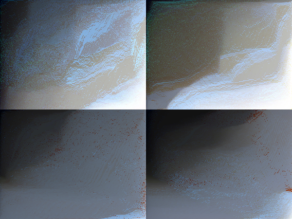

## Pixel sorting
 
 Simple pixel sorting algorithm made in Python

 I tested it on Windows and Linux and it works perfectly on both OS (Python 3.10.6)

 I tested it only with png and jpeg files

 It seems that python automatically sorts colors by chroma when you give it an array of rgb pixels, but I plan to add different ways of sorting, like sort by saturation or by a specific color

 Requires [Pillow Python Imaging Library (Fork)](https://github.com/python-pillow/Pillow)
 
 `pip install Pillow`

## Usage:
    pixel_sort.py [-mode] [-order] [delta] [output filename] [input file]

    mode
        -h 
            Sort horizontally
        -v
            Sort vertically
        -hv
            Sort horizontally and then vertically
        -vh 
            Sort vertically and then horizontally
    
    order
        -a
            Ascending order
        -d
            Descending order

    delta
        integer
            Divide the image into the given number and order each of the parts separately (see example)

## Examples:

`Input file`

`python3 pixel_sort.py -h -a 1 eg0 car.png`

`python3 pixel_sort.py -v -d 1 eg1 car.png`

`python3 pixel_sort.py -v -a 32 eg2 car.png`

`python3 pixel_sort.py -hv -d 2 eg3 car.png`

